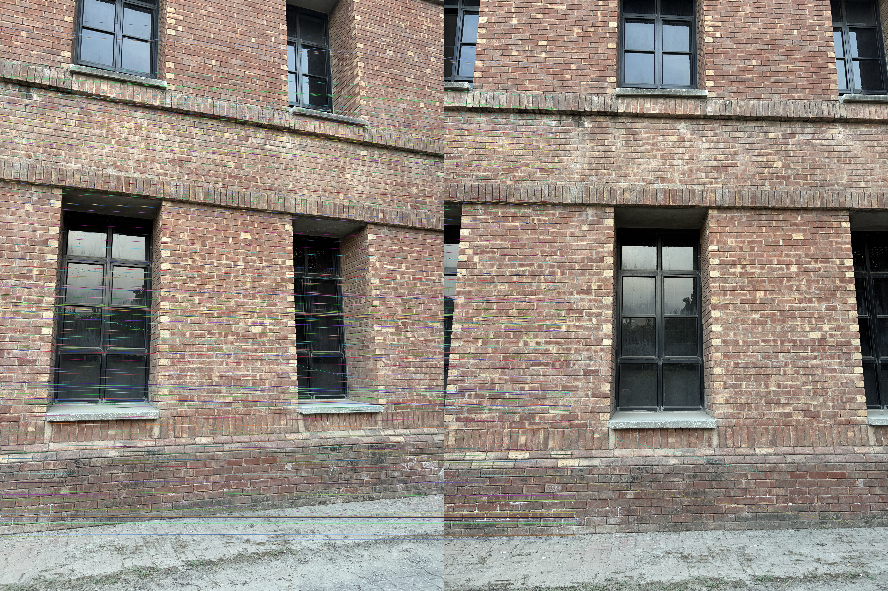
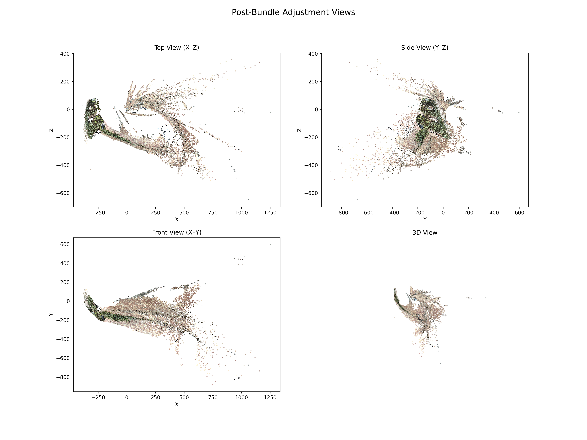
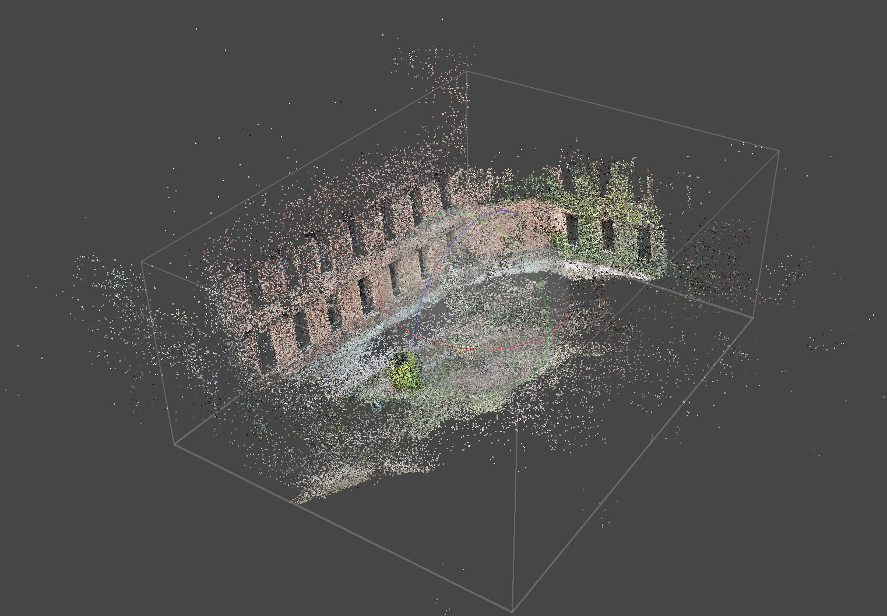

# Structure from Motion (SfM) Pipeline

A Python implementation of an Incremental Structure from Motion pipeline. This system reconstructs sparse 3D point clouds and camera poses from a sequence of 2D images. The pipeline includes automatic intrinsic calibration via EXIF data, feature extraction, 2-view initialization, iterative PnP registration, and global Bundle Adjustment (BA) using sparse optimization.

## 📂 Project Structure

```text
Final Project/
├── .venv/                   # Virtual Environment
├── data/                    # Input image sequences (.jpg)
├── outputs/                 # Results (PLY files, poses, visualizations)
├── web_viewer/              # WebGL-based visualization tool
│   ├── data/                # Converted JSON camera data
│   ├── index.html           # Viewer entry point
│   ├── main.js              # Three.js/Visualization logic
│   └── point_cloud.ply      # The 3D model
├── phase1_two_view_sfm.py   # Initial testing: 2-view reconstruction
├── phase2_multiview_sfm.py  # Main Pipeline: Incremental SfM + Bundle Adjustment
├── report.pdf               # Technical report
├── virtual_tour.mov         # Video demonstration of the result
└── README.md
```
#### Breakdown of the Pipeline:
1. Feature Extraction (extract_features)
    - Input: Grayscale Images.Process: Detect blobs/corners (SIFT).  
    - Output: Keypoints (x, y coordinates) and Descriptors (128-d vectors describing the texture).
2. Matching (match_descriptors)
   - Input: Descriptors from Image 1 and Image 2.
   - Process: Find nearest neighbors using KD-Tree (FLANN).
   - Filter ambiguous matches using Lowe's Ratio Test.
   - Output: A list of Good Matches (indices connecting Keypoint A to Keypoint B).
   

3. Essential Matrix Estimation (`estimate_essential`)
   - Input: Matched pixel coordinates + Camera Intrinsics ($K$).
   - Process: Solve $x'^T E x = 0$ inside a RANSAC loop to ignore outliers.
   - Output: The Essential Matrix ($E$) and a boolean Mask (identifying which matches are valid inliers).
4. Pose Estimator (`decompose_essential + choose_initial_pose`)
   - Input: Essential Matrix ($E$).
   - Process: Decompose $E$ via SVD into 4 possible rotation/translation pairs.
   - Triangulate points for all 4; pick the one where points are actually in front of the camera (Cheirality).
   - Output: Relative Rotation ($R$) and Translation ($t$).
5. Triangulation (`triangulate_between_cams`)
   - Input: Camera Poses ($R, t$), Intrinsics ($K$), and Matched Pixels.
    - Process: Project rays from both cameras and find the 3D intersection point that minimizes geometric error.
   - Output: Raw 3D Coordinates ($X, Y, Z$).
6. Bundle Adjustment (`run_bundle_adjustment`)
   - Input: Raw 3D Coordinates, Initial Poses ($R, t$), Observed Pixels.
   - Process: Iteratively tweak $X, Y, Z$ and $R, t$ to minimize the reprojection error (difference between projected 3D points and observed 2D pixels).
   - Output: Refined 3D Structure and Refined Trajectory


The final sparse point cloud was generated using **Metashape**.

[Download Point Cloud (.ply)](https://drive.google.com/file/d/1EPNbo-pcXsQEOdMKMBR3bQuWjQLbAJfa/view?usp=drive_link)

The final 3D reconstruction looked like this:
 

### Result


After using three.js, we tried to make the virtual tour for which here is the demo
[Watch the demo video](https://drive.google.com/file/d/104WQqTp22JKukfzXB08SwD_yl8IsxltM/view?usp=sharing)

